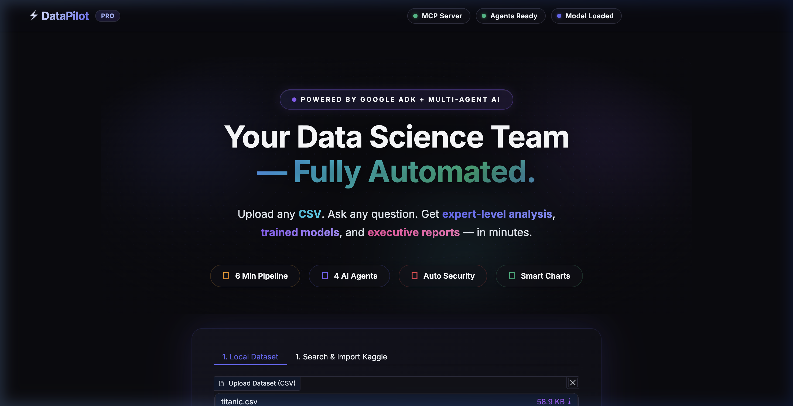
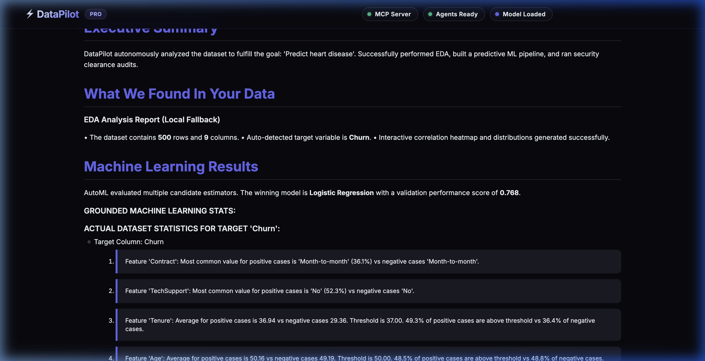

# DataPilot 🚀

[](https://www.python.org/)
[](https://fastapi.tiangolo.com/)
[](https://gradio.app/)
[](https://google.github.io/adk-docs/)
[](https://www.docker.com/)

DataPilot is an **Autonomous Multi-Agent Data Science & Machine Learning Platform** powered by the **Google Agent Development Kit (ADK)** and Gemini 2.0. Users simply upload a CSV dataset, enter a predictive or analytical goal in plain English, and DataPilot's coordinated sub-agents automatically run exploratory data analysis (EDA), model training, security reviews, and compile a dark-themed, premium BI report.

---

## 🛠️ System Architecture

DataPilot uses a multi-agent orchestration pattern coordinated by a master orchestrator:
- **DataPilot_Orchestrator (Master Coordinator)**: Schedules execution flow and propagates data between agents.
- **DataPilot_EDA_Agent (Data Analyst)**: Runs schemas, handles null counts, correlations, and generates Plotly heatmaps.
- **DataPilot_ML_Agent (ML Engineer)**: Standard scales, imputes, encodes, trains classification/regression suites, and serializes estimators.
- **DataPilot_Security_Agent (Security Auditor)**: Audits code injection, model leakage, fairness columns, and logs findings.
- **DataPilot_Report_Agent (BI Reporter)**: Compiles reports in Markdown and responsive dark-themed HTML.

All tools are exposed via a FastMCP **FastAPI Server** on port `8000` with WebSocket state broadcasts.

---

## 📋 Prerequisites

- **Python**: `>=3.11` (or Docker)
- **Google API Key**: Gemini API key from [Google AI Studio](https://aistudio.google.com/)
- **Kaggle API Key** *(Optional)*: For automated dataset imports and submissions.

---

## 🚀 Getting Started

### 1. Installation

Clone this repository and run the setup using `uv`:
```bash
# Install packages and sync environment
uv sync
```

Set up your `.env` configuration in the project root:
```env
GOOGLE_API_KEY=your_gemini_api_key_here
MCP_SERVER_URL=http://localhost:8000
```

### 2. Running Locally

DataPilot consists of two core components (FastAPI MCP server + Gradio Web UI).

**Step 1: Start the MCP Server** (in one terminal tab):
```bash
uv run python main.py mcp
```

**Step 2: Start the Web Dashboard** (in another terminal tab):
```bash
uv run python main.py ui
```
Open your browser and navigate to: `http://localhost:8080`

---

## 🐳 Running with Docker

You can launch both services together using Docker Compose in a single command:

```bash
docker-compose up --build
```
- **Web UI URL**: `http://localhost:7860`
- **MCP Server URL**: `http://localhost:8000`

Both services share folders (`uploads/` and `outputs/`) via volume mounts.

---

## 💻 Using the CLI

DataPilot has a CLI interface utilizing `Typer` which includes progress spinners and color-coded status outputs:

```bash
# View all available CLI commands
uv run python main.py cli --help

# 1. Run full multi-agent pipeline
uv run python main.py cli run --dataset uploads/customer_churn.csv --goal "Predict customer churn"

# 2. Run EDA only
uv run python main.py cli eda --dataset uploads/customer_churn.csv

# 3. Check connectivity status and last run results
uv run python main.py cli status

# 4. Submit prediction file to Kaggle competition
uv run python main.py cli submit --predictions outputs/predictions.csv --competition customer-churn-prediction
```

---

## 📸 User Interface Preview

### Home Dashboard


### Results Dashboard & BI Report


---

## ⚙️ CI/CD Workflow

DataPilot includes a GitHub Actions continuous integration workflow defined in `.github/workflows/ci.yml`. This workflow:
1. Runs on every push or pull request to the `main` or `master` branch.
2. Sets up the Python environment using `actions/setup-python` and parses `pyproject.toml`.
3. Installs `uv` for lightning-fast package dependency synchronization.
4. Checks for linting violations and code formatting using `ruff`.
5. Runs the test suite via `pytest` to ensure all agent tools and pipelines are functional.

---

## 🛡️ Deployment to Google Cloud Run

To deploy the containerized platform to Google Cloud Run, execute the deployment script:
```bash
./deploy.sh
```
This builds the container, runs health checks on local ports, pushes the image to GCR, and deploys. The deployment URL will be printed on completion.

